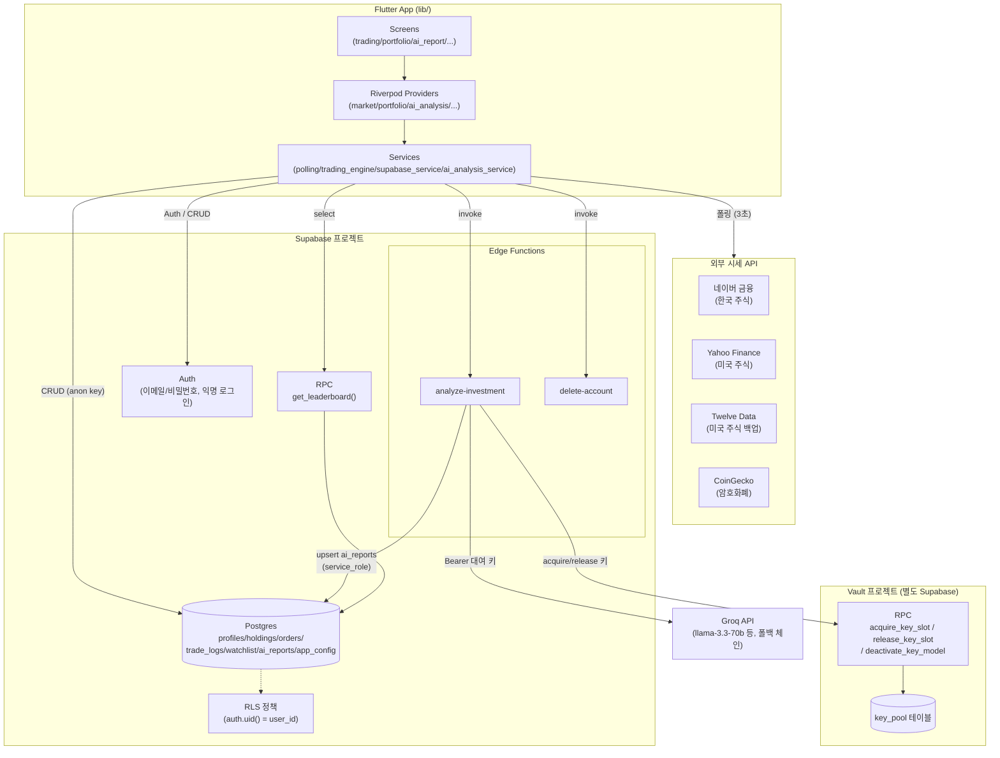
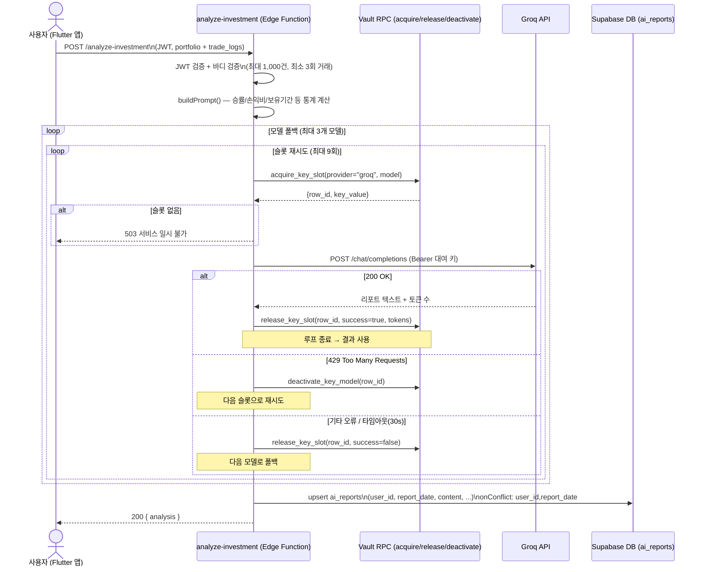
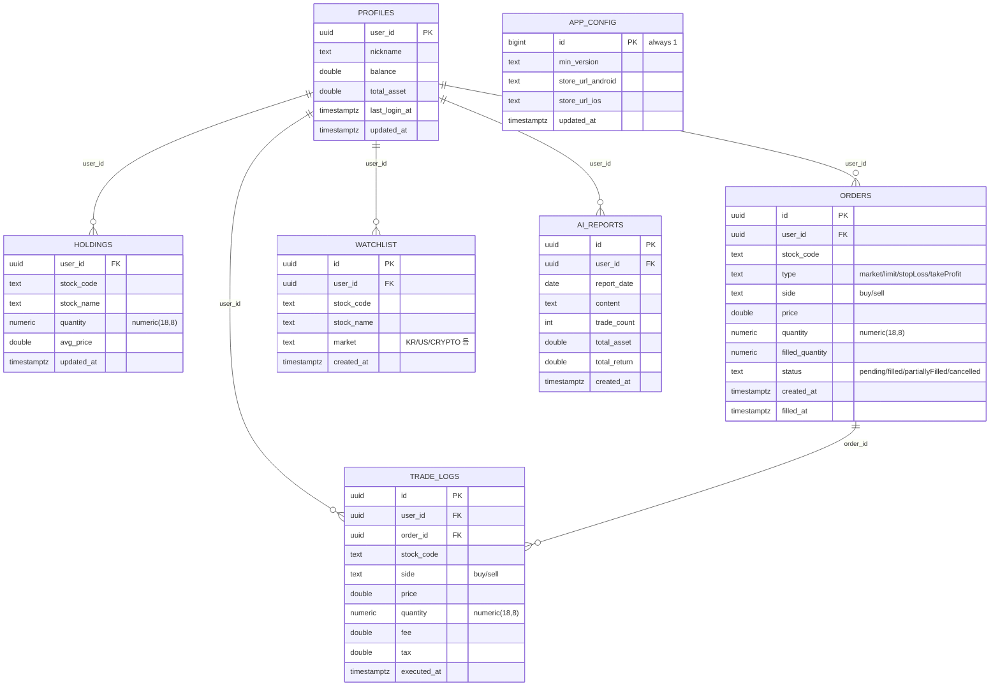
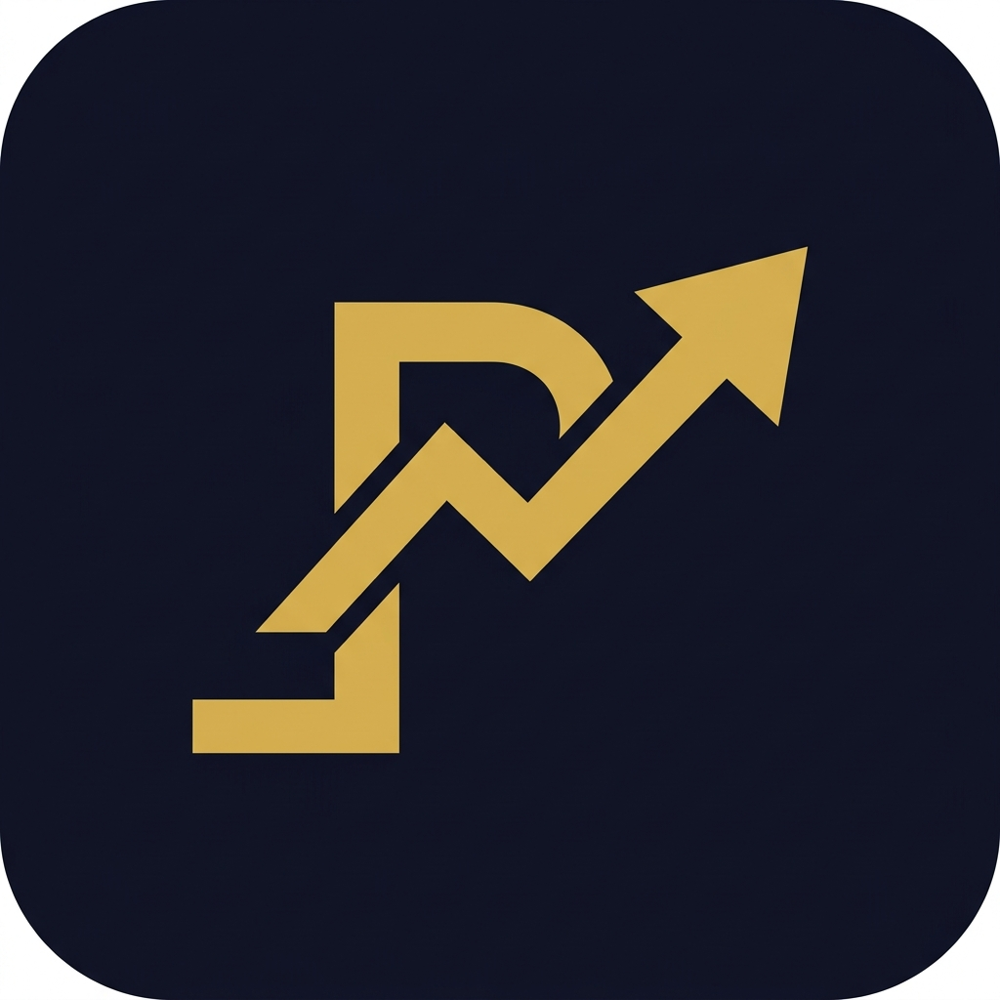

# ProTrading (프로트레이딩)

실제 증권사 MTS와 동일한 환경의 **모의 투자 연습 앱**입니다.
가상 자금 1억원으로 한국 주식, 미국 주식, 암호화폐를 실전처럼 매매하세요.

> **현재 버전: 1.0.5** (Flutter 3.11+ / Dart 3.11+)

---

## 주요 기능

### 멀티 마켓 실시간 시세
- **코스피** 100종목 / **코스닥** 50종목
- **미국 주식** 30종목 - AAPL, NVDA, TSLA 등 (Yahoo Finance API + Twelve Data API 백업)
- **암호화폐** 50종목 - BTC, ETH, SOL 등 (CoinGecko API)
- 3초 간격 배치 폴링 + 장 운영시간 자동 감지 (장 종료 시 시세 고정)
- API 실패 시 가상 시세 자동 폴백 (장 운영시간에만)
- 종목 검색 (네이버 자동완성 API)
- Twelve Data API: 무료 티어 기준 분당 8회 / 배치 호출로 1 API 콜에 8종목 동시 조회

### 캔들 차트 (Flame 엔진)
- 60FPS 실시간 캔들스틱 차트 렌더링
- **한국 주식** (네이버 금융), **미국 주식** (Yahoo Finance), **암호화폐** (CoinGecko OHLC) 캔들 지원
- 핀치 줌 / 좌우 스크롤
- 현재가 점선 라인 + 가격 그리드 자동 계산
- 양봉(빨간) / 음봉(파란) 한국 표준 색상

### 호가창 (Flame 엔진)
- 매도/매수 5단계 호가 60FPS 렌더링
- 잔량 바 보간 애니메이션 (0.5초 스무딩)
- 0.5초마다 잔량 ±2% 미세 진동 (살아있는 시장 느낌)
- 체결 시 해당 가격대 하이라이트 효과
- 호가 탭 시 지정가 주문 자동 입력

### 체결 엔진
- **시장가 주문**: 현재가 즉시 체결
- **지정가 주문**: 현재가와 주문가 비교 → 즉시 체결 또는 미체결 대기
- 미체결 주문 자동 체결 감시
- 매매 수수료 0.015% / 매도 세금 0.23%
- 주문 확인 바텀시트 (수수료, 세금, 총 결제금액 표시)
- 소수점 수량 거래 지원 (암호화폐)

### AI 모의 투자 리포트
- AI 기반 투자 분석
- 포트폴리오 + 전체 체결 내역을 기반으로 6개 섹션 리포트 자동 생성
  - 투자 성향 / 수익성 분석 / 리스크 관리 평가 / 매매 패턴 분석 / 개선 권고사항 / 종합 의견
- 하루 1회 발급 제한 (당일 upsert — 서버 저장)
- 과거 리포트 날짜별 히스토리 조회 (날짜 탭 UI)
- 최소 3회 이상 거래 후 발급 가능
- Supabase Edge Function (`analyze-investment`) 처리 — DoS 방지 포함 (최대 1,000건)

### 포트폴리오
- 총 자산 / 예수금 / 수익률 실시간 표시
- 보유 종목별 평균 매수단가, 평가손익, 수익률
- 최근 체결 이력

### 관심종목
- 종목 상세 화면에서 ★ 버튼으로 관심종목 추가/삭제
- 관심종목 실시간 시세 표시
- 좌로 스와이프 삭제 (취소 가능)
- Supabase 동기화

### 유저 랭킹 (리더보드)
- 총 자산 기준 전체 사용자 순위 (상위 100명)
- Supabase RPC `get_leaderboard()` — SECURITY DEFINER 함수로 닉네임/총자산만 안전하게 노출
- 상위 1~3위 메달 하이라이트 (금/은/동)
- 초기 1억 대비 수익률 표시
- 닉네임 미설정 유저는 '트레이더 N' 자동 부여

### 인증 시스템
- 이메일/비밀번호 회원가입 + 로그인
- 게스트 로그인 (익명 — Supabase Anonymous Sign-in)
- 서비스 이용약관 동의 (회원가입 / 게스트 모두 적용)
- 세션 유지 (자동 로그인)

### 버전 관리 (강제 업데이트)
- 앱 실행 시 Supabase `app_config` 테이블의 `min_version`과 현재 버전 비교
- 최소 버전 미만이면 스토어 이동 강제 (Android / iOS 분기)
- 네트워크 오류 시 업데이트 불필요로 처리 (앱 진입 허용)

### 설정
- 닉네임 변경
- 테마 변경 (다크 / 라이트 / AMOLED)
- 글씨 크기 조절 (6단계 슬라이더)
- 로그아웃
- 회원탈퇴 (Edge Function으로 DB + Auth 계정 완전 삭제)

---

## 기술 스택

| 구분 | 기술 |
|------|------|
| Framework | Flutter 3.11+ |
| Game Engine | Flame (캔들 차트 + 호가창 렌더링) |
| State Management | Riverpod |
| Backend | Supabase (Auth, Database, Edge Functions, RLS) |
| 한국 주식 | 네이버 금융 API |
| 미국 주식 | Yahoo Finance API + Twelve Data API |
| 암호화폐 | CoinGecko API |
| 데이터 전략 | Intelligent Polling (3초) + Micro Tick (0.5초) |
| 보안 | Supabase RLS (모든 테이블), SECURITY DEFINER RPC |

---

## 아키텍처

Flutter 앱(Riverpod 상태관리)이 시세 API(네이버/야후/트웰브데이터/코인게코)를 폴링해 화면을 그리고, 사용자 데이터(잔고/보유종목/주문/체결/관심종목/AI리포트)는 Supabase(Postgres + RLS)에 저장한다. AI 리포트 생성과 회원탈퇴는 Supabase Edge Function으로 분리되어 있고, Edge Function은 LLM API 키를 직접 갖지 않고 별도의 **Vault(키 풀 관리) 프로젝트**에서 그때그때 키를 대여(acquire)/반납(release)해 Groq를 호출한다.



**핵심 설계**
- **키 격리**: Groq API 키는 앱/Edge Function에 저장되지 않는다. `analyze-investment`가 요청마다 Vault RPC로 키를 대여하고, 사용 후 토큰 사용량과 함께 반납한다 → 키 노출 범위 최소화 + 여러 프로젝트가 키 풀을 공유 가능.
- **최소 권한 노출**: 리더보드는 `get_leaderboard()` SECURITY DEFINER RPC로 닉네임/총자산만 노출, `profiles` 원본 테이블은 RLS로 본인 행만 접근 가능.
- **서버 검증**: `analyze-investment`는 JWT로 사용자 인증 후 요청 바디 형식·최대 체결건수(1,000건)를 검증해 DoS를 방지한다.

## 키 슬롯 획득/해제 흐름 (`analyze-investment`)

Groq API 429(rate limit) 응답 시 키 슬롯을 비활성화하고 최대 9회까지 다른 슬롯으로 재시도, 그래도 실패하면 모델을 3단계(`llama-3.3-70b-versatile` → `llama-4-scout-17b` → `llama-3.1-8b-instant`)로 폴백한다.



## 데이터 모델



`holdings`는 `(user_id, stock_code)` 유니크 제약(upsert 기반), `ai_reports`는 `(user_id, report_date)` 유니크 제약(하루 1회 upsert), `watchlist`는 `(user_id, stock_code)` 유니크 제약. `app_config`는 `id=1` 단일 행만 허용(`CHECK` 제약)되는 전역 설정 테이블로 사용자와 무관하다.

---

## 프로젝트 구조

```
lib/                              # 38 파일
├── main.dart                     # 앱 진입점 (Supabase 초기화, 테마, 버전 체크)
├── core/
│   ├── config/                   # Supabase URL/Key
│   ├── constants/                # 상수 (초기자금 1억, 수수료율)
│   ├── theme/                    # 다크/라이트/AMOLED 테마 + AppColors
│   └── utils/                    # 가격/금액 포맷터
├── models/
│   ├── stock.dart                # StockPrice, CandleData, OrderBook
│   ├── portfolio.dart            # Holding, Portfolio (PnL 계산)
│   └── trade.dart                # Order, TradeLog
├── services/
│   ├── naver_finance_service.dart  # 한국 주식 시세 + 검색
│   ├── yahoo_finance_service.dart  # 미국 주식 시세 + 캔들
│   ├── twelve_data_service.dart    # 미국 주식 배치 시세 (백업/보조)
│   ├── coingecko_service.dart      # 암호화폐 시세 + 캔들
│   ├── polling_service.dart        # 지능형 폴링 + 마이크로 틱
│   ├── mock_data_service.dart      # 합성 호가창 + 폴백 시세
│   ├── trading_engine.dart         # 체결 엔진 (시장가/지정가)
│   ├── ai_analysis_service.dart    # AI 리포트 Edge Function 호출
│   ├── supabase_service.dart       # Supabase CRUD + 관심종목
│   └── version_check_service.dart  # 강제 업데이트 버전 체크
├── providers/
│   ├── service_providers.dart      # 서비스 DI
│   ├── market_providers.dart       # 멀티마켓 시세 스트림
│   ├── portfolio_providers.dart    # 잔고/보유종목/주문 (Supabase 연동)
│   ├── watchlist_provider.dart     # 관심종목
│   ├── ai_analysis_provider.dart   # AI 리포트 상태 + 히스토리
│   └── settings_providers.dart     # 테마/글씨크기 (SharedPreferences)
├── widgets/
│   ├── candle_chart.dart           # Flame 캔들차트
│   ├── order_book_widget.dart      # Flame 호가창
│   └── confirm_bottom_sheet.dart   # 공통 확인 바텀시트
└── screens/
    ├── auth/
    │   ├── login_screen.dart         # 로그인
    │   ├── signup_screen.dart        # 약관 동의 (회원가입/게스트 공통)
    │   ├── signup_form_screen.dart   # 이메일/비밀번호 입력
    │   ├── terms_screen.dart         # 약관 전문 보기
    │   └── token_auth_screen.dart    # 토큰 기반 인증
    ├── home_screen.dart              # 하단 네비 (종목/관심/자산/AI/랭킹/설정)
    ├── stock_list_screen.dart        # 종목 리스트 (4개 마켓 탭)
    ├── watchlist_screen.dart         # 관심종목
    ├── trading_screen.dart           # 매매 화면 (차트+호가+주문)
    ├── portfolio_screen.dart         # 자산 현황
    ├── ai_report_screen.dart         # AI 투자 리포트 + 히스토리
    ├── leaderboard_screen.dart       # 유저 랭킹
    └── settings_screen.dart          # 설정

supabase/
├── functions/
│   ├── analyze-investment/       # AI 리포트 생성 + 저장 Edge Function
│   └── delete-account/           # 회원탈퇴 Edge Function
└── migrations/
    ├── 20260415052253_remote_commit.sql          # 초기 스키마
    ├── 20260415143521_quantity_to_numeric.sql    # 소수점 수량 지원
    ├── 20260416000000_rls_and_missing_tables.sql # RLS + watchlist/ai_reports 테이블
    ├── 20260416000001_leaderboard_rpc_and_indexes.sql  # 리더보드 RPC + 성능 인덱스
    └── 20260416200000_app_config.sql             # 강제 업데이트 설정 테이블
```

---

## 데이터베이스 스키마

| 테이블 | 설명 |
|--------|------|
| `profiles` | 닉네임, 예수금, 총자산, 마지막 접속일 |
| `holdings` | 보유 종목 (종목코드, 수량, 평균단가) |
| `orders` | 미체결 주문 목록 |
| `trade_logs` | 체결 내역 (매수/매도, 수수료, 세금) |
| `watchlist` | 관심종목 (마켓 구분 포함) |
| `ai_reports` | AI 리포트 (날짜별 1건, upsert) |
| `app_config` | 강제 업데이트용 최소 버전 + 스토어 URL |

**RLS:** 모든 사용자 테이블에 Row Level Security 적용 (`auth.uid() = user_id` 기반)

**RPC 함수:**
- `get_leaderboard()` — SECURITY DEFINER, 닉네임/총자산만 노출, 상위 100명 반환

---

## 시작하기

### 사전 요구사항
- Flutter SDK 3.11+
- Dart SDK 3.11+

### 설치 및 실행

```bash
git clone https://github.com/kimdzhekhon/Pro_trading.git
cd Pro_trading
flutter pub get
flutter run
```

### 빌드

```bash
# Android App Bundle (Play Store)
flutter build appbundle --release

# iOS (App Store)
flutter build ipa --release

# APK (직접 설치)
flutter build apk --release
```

### Supabase 설정 (직접 배포 시)

1. [Supabase](https://supabase.com)에서 프로젝트 생성
2. SQL Editor에서 `supabase/migrations/` 내 파일을 순서대로 실행
3. Authentication → Settings → **Anonymous sign-ins** 활성화
4. `lib/core/config/supabase_config.dart`에 URL과 anon key 입력
5. Edge Functions 배포:
   ```bash
   supabase functions deploy delete-account
   supabase functions deploy analyze-investment
   ```
6. Edge Function 환경변수 설정:
   - `SUPABASE_SERVICE_ROLE_KEY` — 리포트 서버 저장용

---

## 앱 아이콘

<p align="center">
  
</p>

---

## 디자인

- 상승: Red (`#FF4444`) / 하락: Blue (`#4444FF`) — 한국 주식시장 표준
- 골드 액센트 (`#FFD700`) — 상위 3위 하이라이트
- 보라색 포인트 (`#6C63FF`) — AI 리포트 UI
- 다크 / 라이트 / AMOLED 3가지 테마 지원

---

## 라이선스

이 프로젝트는 개인 학습 및 연습 목적으로 제작되었습니다.
